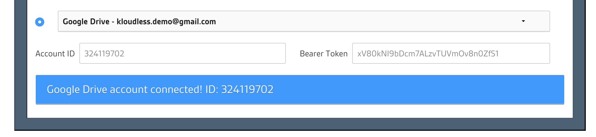

# Kloudless JavaScript SDK

JavaScript SDK for the [Kloudless API](https://kloudless.com).

Kloudless enables apps to integrate with several third-party services with a single integration.

**Sign up for a [Kloudless Application](https://kloudless.com) first before using this SDK.**

For convenience, the SDK Object will be referred as `kloudless`
throughout this document.

## Table of Contents
* [Installation](#installation)
* [Full SDK Reference](#full-sdk-reference)
* [Getting Started](#getting-started)
  * [Initializing Account Object](#initializing-account-object)
  * [Making API Requests](#making-api-requests)
  * [Integrating OAuth Flow](#integrating-oauth-flow)
  * [Handling API Responses](#handling-api-responses)
    * [`data` Property](#data-property)
    * [Resource](#resource)
    * [Resource List](#resource-list)
      * [Resource Pagination](#resource-pagination)
      * [Iterate through all resources](#iterate-through-all-resources)
    * [Download binary](#download-binary)
    * [Generic Response](#generic-response)
  * [Making Requests from Response Objects](#making-requests-from-response-objects)
  * [Handling Request Failures](#handling-request-failures)
* [Other Usages](#other-usages)
  * [Refreshing Response Objects](#refreshing-response-objects)
  * [Calling Upstream Service APIs](#calling-upstream-service-apis)
  * [Keep Returned Bearer Tokens](#keep-returned-bearer-tokens)
  * [Verifying Account Bearer Tokens](#verifying-account-bearer-tokens)
  * [Making Arbitrary API Requests](#making-arbitrary-api-requests)
  * [Setting the API Version](#setting-the-api-version)
* [Development](#development)
* [Build](#build)
* [Test](#test)

## Installation
- Using Node.js or webpack:
  ```
  npm install @kloudless/kloudless
  yarn add @kloudless/kloudless
  ```
  For an ES6 / babel environment:
  ```js
  import kloudless from '@kloudless/kloudless';
  ```
  Or in Node.js environment:
  ```js
  const kloudless = require('@kloudless/kloudless');

- Alternatively you can also use this script tag for vanilla browser JS
  environment:

  ```html
  <script type="text/javascript"
  src="https://static-cdn.kloudless.com/p/platform/sdk/kloudless.js"></script>
  ```
  The SDK Object will be available at `window.Kloudless.sdk`

## Full SDK Reference

The **[SDK Reference](REFERENCE.MD)** contains the full description for each
property and method in the SDK. However, we recommend you proceed through
the steps in the **Getting Started** section below first.

## Getting Started

### Initializing Account Object

Most Kloudless API endpoints require connecting to upstream service account
first. You can start by **navigating to
[API Explorer](https://developers.kloudless.com/api-explorer/) and connect a
storage service account.**

Copy the Bearer Token in the text input box after connecting an account,
and use it to initialize an Account object:

<p align="center">
  
</p>

```js
import kloudless from '@kloudless/kloudless';

const token = BEARER_TOKEN;

const account = new kloudless.Account({
  token
});

// use getDetail() to retrieve account details like email and service name.
account.getDetail().then(() => {
  // `data` property is available after calling getDetail()
  console.log('Account email:', account.data.account);
});
```

### Making API Requests
Once the object is created, you can use it to make API Requests.

For example, you can use `get()` to make GET requests, it returns a Promise
that will be resolved once the API response is returned.

```js
// get root folder metadata
account.get({
  url: 'storage/folders/root/'
}).then((response) => {
  // API response is available at `data` property
  const { data } = response;
  console.log('Can create folders in root folder: ', data.can_create_folders);
});
```

Make a POST request with `post()` and put request body in `data` property:

```js
// create a new folder on root folder
account.post({
  // full URL is https://api.kloudless.com/v1/accounts/me/storage/folders
  url: 'storage/folders',
  data: {
    parent_id: 'root',
    name: 'New Folder Name'
  }
}).then((response) => {
  console.log(`Folder created: ${response.data.name}`);
});
```

Similarly, you can also use `post()`, `patch()`, and `delete()` to
make corresponding http requests.

### Integrating OAuth Flow

In practice, your app will require users to connect their upstream service
account in order to access upstream data and make API request on their
behalf.

For example, users will need to connect their Google Drive account, so that
your app can make requests to Kloudless Storage API and retrieve users'
storage data.

The SDK provides helper methods based on your environment to help users
authorize their accounts using OAuth 2.0.
- Browsers:
  ```js
  let account;

  // open a popup to let user connect a storage service account
  kloudless.connectAccount({
    scope: 'any.storage',
    appId: YOUR_APP_ID,
  }).then((connectedAccount) => {
    account = connectedAccount;
    // you can access account's detail via `data` property
    const { data } = account;
    console.log(`${data.service_name}: ${data.account}`);
  }).then((response) => {
    console.log(response.data);
  });
  ```

- Node.js: (Using [Express](https://expressjs.com/) as an example):
  ```js
  const express = require('express');
  const kloudless require('@kloudless/kloudless');

  const app = express();

  // oauth state should be stored in a session, but to simplify this example,
  // we just use a variable here
  let oAuthState;

  let account;

  // connect a storage service account
  app.get('/', (req, res) => {
    // get OAuth url
    const { url, state } = kloudless.getAuthorizationUrl({
      redirectUri: 'http://localhost:8080/callback',
      scope: 'any.storage',
      appId:  YOUR_APP_ID,
    });
    oAuthState = state;
    // redirect users to this url to login their storage account
    res.redirect(url);
  });

  // get access token from callback url
  app.get('/callback', (req, res) => {
    // create the Account Object from callback url and its query params
    kloudless.completeAuth({
      state: oAuthState,
      redirectUri: 'http://localhost:8080/callback',
      oauthCallbackUrl: req.originalUrl,
      appId: YOUR_APP_ID,
      apiKey: YOUR_API_KEY,
    }).then((token) => {
      account = new kloudless.Account({ token });
      account.getDetail().then(() => {
        // you can access account's detail via `data` property
        const { data } = account;
        res.send(`${data.service_name}: ${data.account}`);
      })
    });
  });

  app.listen(8080);
  console.log('Server running at http://localhost:8080');
  ```

Please refer to [documentation](REFERENCE.MD#kloudless) for detailed usage
of each method in the examples above.

You can also read [Keep Returned Bearer Tokens](#keep-returned-bearer-tokens)
and [Verifying Account Bearer Tokens](#verifying-account-bearer-tokens) for
best practices to manage returned Account object or Bearer Token.

### Handling API Responses

The SDK will wrap API responses into response objects. Depending on what is in
response data, the SDK will create different types of response objects.

#### `data` property
You can always get the original response from API from the `data` property,
regardless of which type of response is returned.

```js
// get file metadata
account.get({
  url: `storage/files/${FILE_ID}/`
}).then((resource) => {
  // print details of this file
  const { data } = resource;
  console.log(
    `Filename: ${data.name}\n`
    + `Created: ${data.created}\n`
    + `Modified: ${data.modified}\n`
    + `Size: ${data.size} bytes`
  );
});
```

#### Resource

A resource represents any Object with an identifier. For example: Files and
folders in the Storage API, calendar events in the Calendar API, and events in
Events API.


```js
// get file metadata
account.get({
  url: `storage/files/${FILE_ID}/`
}).then((resource) => {
  // update filename, notice that we don't need to set URL here
  return resource.patch({
    data: {
      name: NEW_FILE_NAME
    }
  });
}).then((resource) => {
  console.log(`New filename: ${resource.data.name}`);
});

```

#### Resource List

A resource list represents a list of resources. For example: Contents of a
folder, list of calendars under an account, calendar events under a calendar,
or any response that has property `"type"="object_list"`.

Resource lists are represented as [ResourceList](REFERENCE.MD#resource-list)
objects. The `objects` properties contains a list of Resource objects.

```js
// list all calendars of this calendar account
account.get({
  url: 'cal/calendars'
}).then((response) => {
  // print out each calendar's name and description
  response.objects.forEach((resource) => {
    const { data } = resource;
    console.log(`${data.name}: ${data.description}`);
  });
});
```

##### Resource Pagination

You may use the `getNextPage()` method to get the next page without having to
supply a page value:

```js
let resourceList;

// Get the first 5 events from primary calendar
account.get({
  url: 'cal/calendars/primary/events',
  params: {
    page_size: 5
  }
}).then((nextResourceList) => {
  resourceList = nextResourceList;
  displayPage();
})


function displayPage() {
  resourceList.objects.forEach((resource) => {
    console.log(
      `${resource.data.name}: ${resource.data.start}~${resource.data.end}`
    );
  });
}

// retrieve next page and display it when user clicks "Next Page"
function onUserClickNextPage() {
  resourceList.getNextPage().then((nextResourceList) => {
    resourceList = nextResourceList;
    displayPage();
  })
}

```

##### Iterate through all resources

If you'd like to iterate through all resources without handling pagination
by yourself, you can use the `iterate()` helper method. This method will take
a callback function, and it is called multiple times with each resource as
the first argument.

You can also specify `maxResources` if you don't want to iterate through all
resources in one shot.

The promise is resolved with a boolean return value. If there are more
resources ahead, you can call `iterate()` again to continue iterating through
following resources, or call `resetIterateIndex` to go back to the very first
resource and start over.

```js
let events;

account.get({
  url: 'cal/calendars/primary/events',
  params: { page_size: 10 }
}).then((resourceList) => {
  events = resourceList;
})

function displayEvent(event) {
  // print out event's name and time
  console.log(
    `[${event.data.id}] ${event.data.name}:`
    + `${event.data.start} ~ ${event.data.end}`
  );
}

// show the next 5 calendar events when user clicks "show more"
function onUserClickShowMore() {
  events.iterate({
    callback: displayEvent,
    maxResources: 5
  }).then((hasRemainResources) => {
    if (hasRemainResources) {
      console.log('click "show more" for more events');
    } else{
      console.log('no more events for this calendar');
    }
  });
}

// reset the iteration when the user clicks "clean all"
// when user clicks "show more" next time, the first 5 events will be
// displayed again
function onUserClickCleanAll() {
  events.resetIterateIndex();
}

```


#### Download binary

Certain endpoints like thumbnails or file content will return binaries. The
responses will contain [Binary](REFERENCE.MD#binary) objects.
The `data` property will be different depending on app's environment:

- In Browsers, it will be contain binary contents.
  It is not recommended to access this data property directly. Instead, you
  could use `download` method to prompt a download dialog:
  ```js
  account.get({
    url: `storage/files/${FILE_ID}/contents/`,
  }).then((binary) => {
    // prompt download dialog in browser
    binary.download(FILENAME);
  });
  ```


- In Node.js, it is a readable Stream Object passed from axios
  ```js
  const express = require('express');
  const kloudless require('@kloudless/kloudless');

  const app = express();

  // assume Account Object is already created

  app.get('/download/binary', (req, res) => {
    account.get({
      url: `storage/files/${FILE_ID}/contents/`,
    }).then((binary) => {
      // prompt download dialog in browser
      res.setHeader('content-type', binary.headers['content-type']);
      res.setHeader('content-disposition', `attachment; filename=${FILENAME}`);
      binary.data.pipe(res);
    });
  });
  ```

#### Generic Response

For responses that cannot be classified as any of the object types listed above,
a general [Response](#REFERENCE.MD#response) Object is created. The Response
class is also the parent class of all response types mentioned above.

```js

// calendar API: find availability
account.post({
  url: 'cal/availability',
  data: {
    calendars: ['primary'],
    meeting_duration: 'PT1H',
    constraints: {
      time_windows: [{
          start: '2017-05-20T08:00:00+07:00',
          end: '2017-05-20T12:00:00+07:00'
      },{
          start: '2017-05-21T08:00:00+07:00',
          end: '2017-05-21T12:00:00+07:00'
      }]
    }
  }
}).then((response) => {
  /** response.data would look like:
  {
    "api": "calendar",
    "type": "availability",
    "time_windows": [
      {
        "start": "2017-05-20T01:00:00Z",
        "end": "2017-05-20T05:00:00Z"
      },
      {
        "start": "2017-05-21T01:00:00Z",
        "end": "2017-05-21T05:00:00Z"
      }
    ]
  }
  */
  // print available times
  response.data.time_windows.forEach((time) => {
    console.log(`${time.start} ~ ${time.end}`);
  })

});
```

#### Making Requests from Response Objects

The Response objects can also be used to make further requests by using
`get()`, `post()`, `put()`, `patch()`, and `delete()`.
You only need to append URL segments that follow previous request url.


```js
// get the default calendar under this account
account.get({
  url: 'cal/calendars/primary'
}).then((resource) => {
  // print calendar name
  console.log(`Events on calendar ${resource.data.name}`);
  // get the first 5 events of this calendar
  return resource.get({
    // full URL is cal/calendars/primary/events
    url: 'events',
    params: { page_size: 5 }
  })
}).then((resourceList) => {
  resourceList.objects.forEach((resource) => {
    // print out event's name and time
    console.log(
      `${resource.data.name}: ${resource.data.start} ~ ${resource.data.end}`
    );
  })
});
```

Refer to the [documentation](REFERENCE.MD#request-options)
on how the url is applied when making further requests from response objects.

### Handling Request Failures

Use `catch` to catch any error when making API requests, the error will be
wrapped into [Exception](REFERENCE.MD#exception) Object, and you can get
detailed information via `statesCode`, `errorCode`, and `message` field

```js
// assume you make a request to team API with a non-admin account
account.get({
  url: 'team/groups'
}).then((response) => {
  // ...
}).catch((exception) => {
  // if API returns a error
  if (exception.response) {
    // print 'Error: [forbidden] Only administrators can perform this action'
    console.error(`Error: [${exception.errorCode}] ${exception.message}`);
  } else {
    // if no response returned or no requests were made due to invalid options
    console.error(`Error: ${exception.message}`);
  }
});
```

## Other Usages

### Refreshing Response Objects

To retrieve the latest data of the response object, simply call `refresh()`.


```js
const fileId = SAMPLE_FILE_ID;

function displayFileInfo(resource) {
  // ...
}

// get this file's metadata
account.get({
  url: `storage/files/${fileId}/`
}).then((resource) => {
  // we want to retrieve latest metadata every 30 seconds in case file is updated
  // via user outside this app.
  displayFileInfo(resource);
  setTimeout(() => {
    resource.refresh();
    // display latest information
    displayFileInfo(resource);
  }, 30000);
});

```

### Calling Upstream Service APIs

You can make requests to upstream service API (a.k.a. pass-through requests)
by using `raw`, in case certain service specific usages are not covered
by Kloudless API.

Note that the response will be a response object from axios,
there is no object created by SDK.

```js
account.raw({
  url: 'https://api.dropboxapi.com/2/files/list_folder',
  method: 'POST',
}).then((response) => {
  const { data } = response;
  data.entries.forEach((folder) => {
    console.log(folder.name);
  })
});

```

### Keep Returned Bearer Tokens

You should keep the returned Bearer Token via OAuth flow
saved somewhere safe (in database, for example), for reuse.
This will avoid you asking the user to authorize their account repeatedly.

In browsers, the `connectAccount` method is resolved with a Account object,
you can retrieve the token via the `token` property.

```js
kloudless.connectAccount({
    scope: 'any.storage',
    appId: YOUR_APP_ID,
  }).then((account) => {
    console.log('Bearer Token: ', account.token);
  });
```

### Verifying Account Bearer Tokens

It is recommended that you verify the Bearer Token before you use it, if the
token was not originally retrieved from Kloudless API, .

```js
const token = BEARER_TOKEN; // assume you have retrieved a saved token

kloudless.verifyToken({
  appId: YOUR_APP_ID,
  token,
  initAccount: true // return Account object after verification
}).then((result) => {
  if (result.valid) {
    const  { account } = result;
    console.log('Account email:', account.data.account);
  } else {
    console.error('Token is not valid:', result.error);
  }
}).catch((exception) => {
  // if other API request errors happened
  console.log(`Error initializing account: ${exception.message}`);
});
```

### Making Arbitrary API Requests

The SDK Object can make API requests with `get()`, `put()`, `post()`,
`patch()`, and `delete()` as well. You will need to type full API Url and
supply `Authorization` header on your own if required.

```js
// list all supported storage services
kloudless.get({
  url: 'public/services',
  params: {
    apis: 'storage'
  }
}).then((response) => {
  response.data.objects.forEach((service) => {
    console.log(service.friendly_name);
  });
});

// get detail of the account associated to the bearer token
kloudless.get({
  url: 'accounts/me',
  headers: {
    Authorization: `Bearer ${TOKEN}`
  }
}).then((response) => {
  const { data } = response;
  console.log(`${data.service_name}: ${data.account}`);
});
```

### Setting the API Version

By default this SDK uses v1 of the Kloudless API. You can use
kloudless.setApiVersion() method to change the API Version.

```js
// change API Version to v2
kloudless.setApiVersion(2);
```

## Development

Run `npm install` to install dev dependencies for development, build and
test.

- Web
```bash
BASE_URL=<base_url> KLOUDLESS_APP_ID=<app_id> npm run dev_web
```
- Node.js
```bash
BASE_URL=<base_url> KLOUDLESS_APP_ID=<app_id> KLOUDLESS_API_KEY=<api_key> npm run dev_node
```
**Note**: Currently no hot reloading is provided for Nodejs development
environment.

## Build
```bash
npm run build
```

## Test
```bash
npm run test
```

## Support

Feel free to contact us at support@kloudless.com with any feedback or questions.
